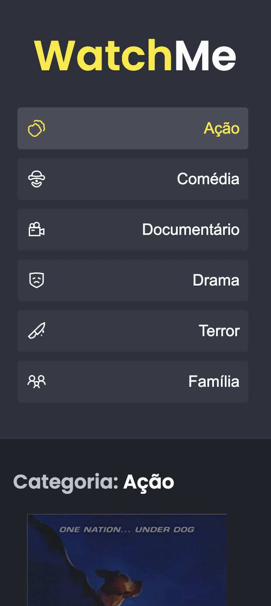
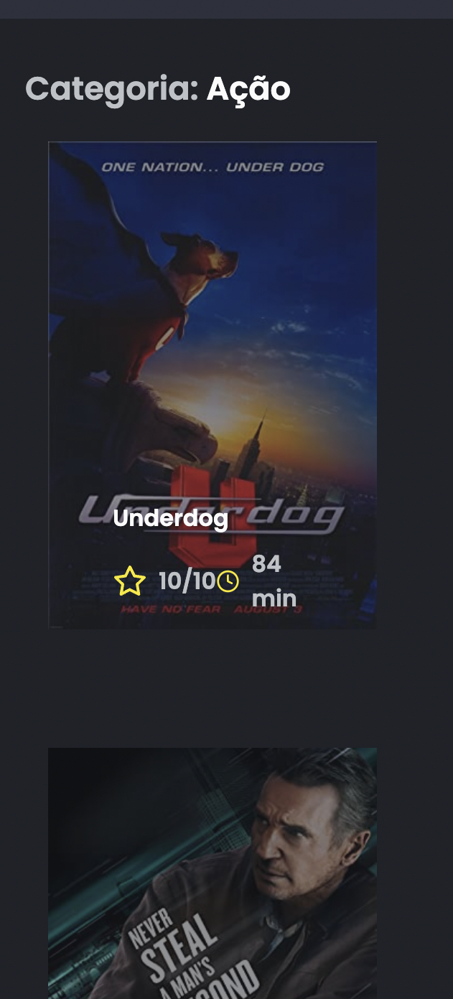
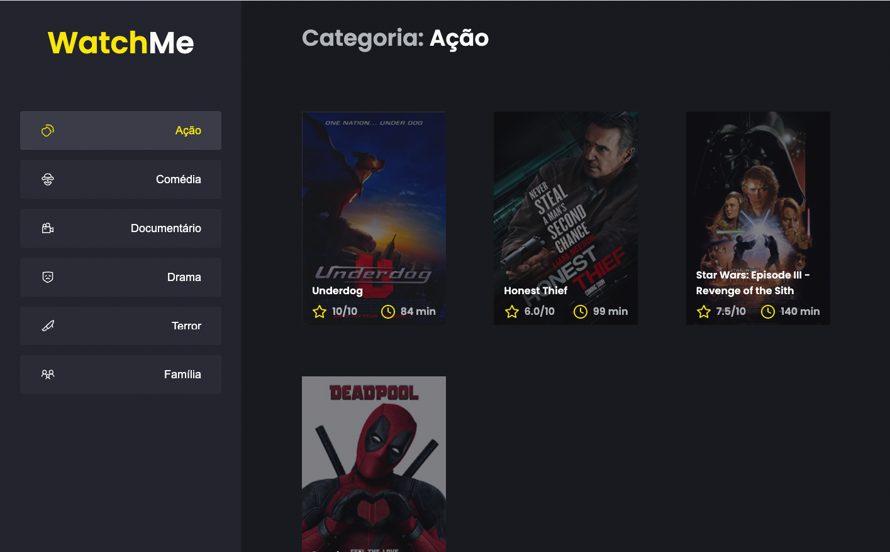

# ignite-reactjs-componentizando-a-aplicacao

## Sobre o Desafio ##

Foi criado uma aplicação para treinar o que aprendeu até agora no ReactJS. 
O principal objetivo foi refatorar uma página para listagem de filmes de acordo com o gênero.

<h2>Tecnologias 💻 </h2>

HTML5 - SASS - ReactJS - TypeScript
Modelo responsivo.

<h2>Link para visualização 🔗 </h2>

Cliqui aqui - Countdown.

Layout Mobile e Desktop

      
      
    

